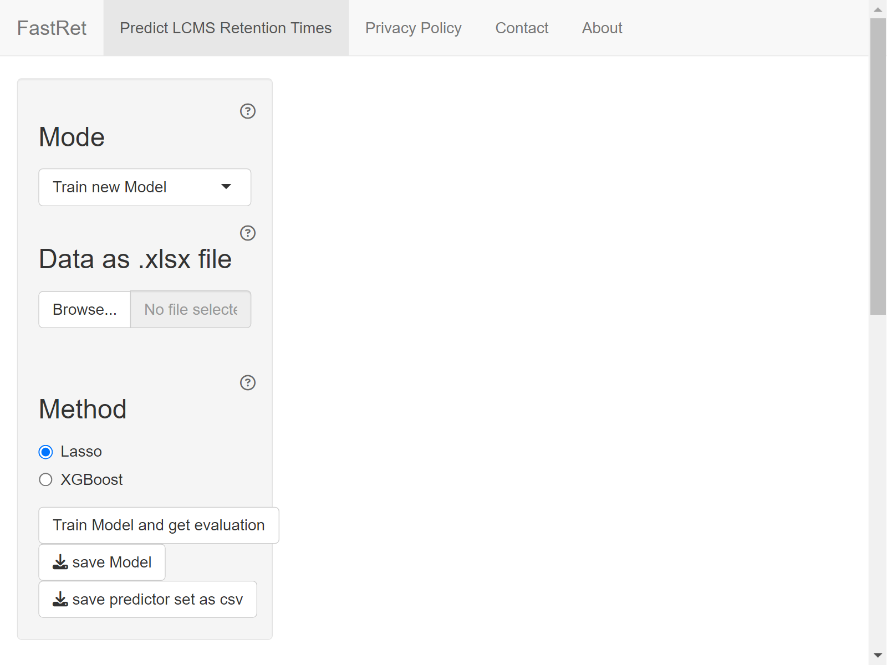
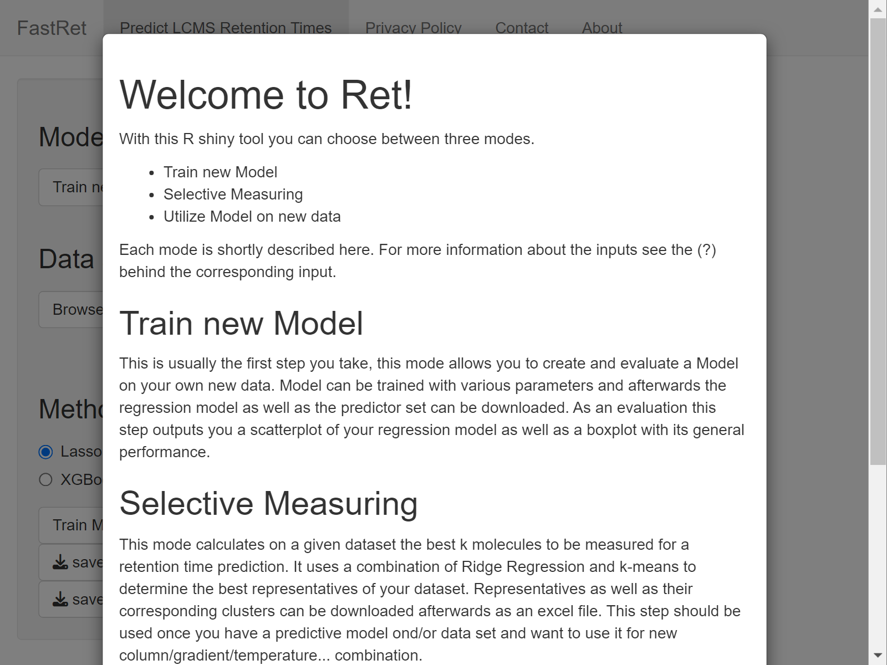
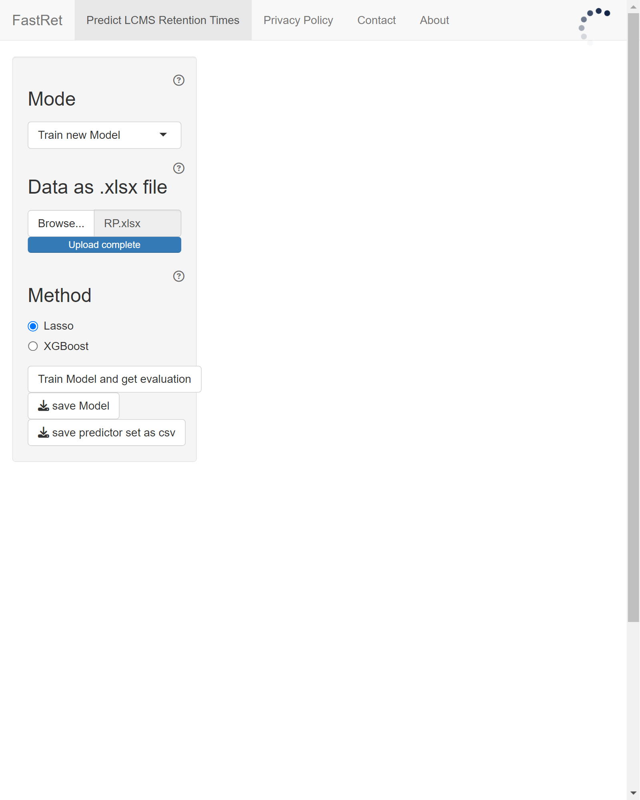
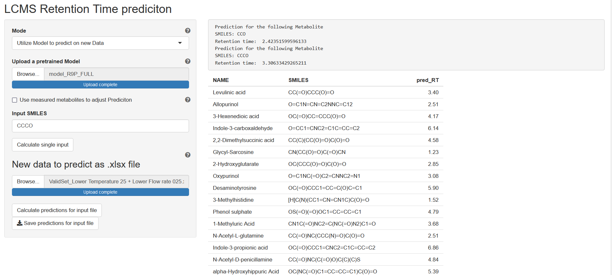

```{r, include = FALSE}
knitr::opts_chunk$set(collapse = TRUE, comment = "#>")
```

This tutorial will show how you can start the FastRet GUI and explain the features it provides.

# Starting the GUI

To start the GUI, [install the package](#installation) and then run the following command in an interactive R terminal:

```{r gui, eval = FALSE}
FastRet::start_gui()
```

After running the above code, you should see an output like

```
Listening on http://localhost:8080
```

in your R console. This means that the GUI is now running and you can access it via the URL <http://localhost:8080> in your browser. If your terminal supports it, you can also click on the displayed link.

<a href="GUI-Usage/start-page.png"></a>
<a href="GUI-Usage/mode-help.png"></a>

By default, the GUI opens in mode *Train new Model*. To apply or adjust pretrained models, select mode *Predict Retention Time* or *Adjust existing Model* instead. For more information about the individual modes and the various input fields, click on the little question mark symbols next to the different input fields or read the following sections.

# Train new Model

In mode *Train new Model* you can upload excel files containing the names, SMILES and retention times of metabolites measured on your specific chromatogrpahy column and use this data to train a predictive model.
FastRet includes an example Excel file  with retention times for 442 metabolites measured on a reverse phase liquid chromatography column at a temperature of 35 degree celsius and a flowrate of 0.3ml/min.
To print the file path of this excel file and a preview of its contents, enter the following lines an interactive R session:

```{r example-file, eval = TRUE}
path <- system.file("extdata", "RP.xlsx", package = "FastRet")
cat(path, "\n", sep = "")
df <- xlsx::read.xlsx(path, 1)
head(df)
```

To start model training, upload your Excel file and click the *Train Model* button.
Training the model might take some time, depending on the size of the training set.
When you click on `Show console logs` you can see the progress of the training process.
Upon completion, performance measures and a table of training dataset is shown.
For further details about the training process and the performance measures, see section [Model-Training](https://spang-lab.github.io/FastRet/articles/Package-Internals.html#model-training) of article [Package-Internals](https://spang-lab.github.io/FastRet/articles/Package-Internals.html).

<a href="GUI-Usage/model-training.png"></a>
<a href="GUI-Usage/model-performance.png"></a>

To use the trained model to predict retention times for new molecules, you have to:

1. Save the model by clicking the *Save Model* button
2. Switch to model *[Predict Retention Times](#predict-retention-times)*
3. Upload the model again while in mode *Predict Retention Times*
4. Enter the SMILES of the molecules you want to predict retention times for
5. Press *Predict Retention Times*

A more detailed guide on using the FastRet GUI for prediction is given in the next section [Predict Retention Times](#predict-retention-times).

# Predict Retention Times

In this mode, previously saved models can be used to make predictions for new data. To do so

1.  Click the *Browse* button from section *Upload a pretrained Model* and select the model you saved in the previous step
2.  Either enter the SMILES of your molecule of interest in the *Input SMILES* text field or
3.  Click the *Browse* button from section *Upload SMILES as xlsx* and select an Excel file containing columns NAME and SMILES
4.  Click button *Predict* at the bottom of the side bar

{width=45%}


# Adjusting existing model

If you have measured some metabolites on your new experiment setup that were also measured on the original setup, you can use this method to adjust your model for your new column. To do so, switch to mode *Adjust existing Model* and upload the model you want to adjust. Then upload an Excel file containing the retention times of the metabolites measured on your new column. The Excel file should contain columns NAME, SMILES and RT. After clicking the *Adjust Model* button, the model will be adjusted and you can use it to predict retention times for new molecules measured on your new column.

{width=45%}

# Selective Measuring

This mode calculates, for a given data set, the best k molecules to be measured for a retention time prediction on a new experiment setup.
It uses a combination of Ridge Regression and k-means to determine the best representatives of your dataset.
Representatives as well as their corresponding clusters can be downloaded afterwards as an excel file.
This step should be used once you have a predictive model and/or data set and want to adjust it to work for a new column with adjusted chromotagrphic properties such as gradient, temperature, etc.

