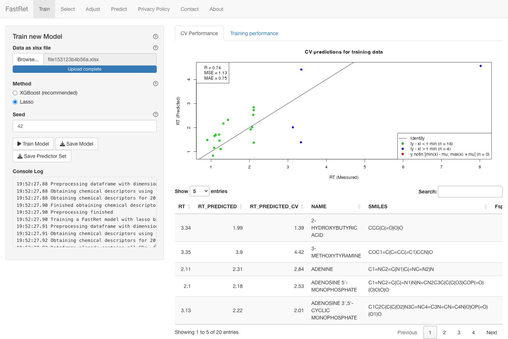
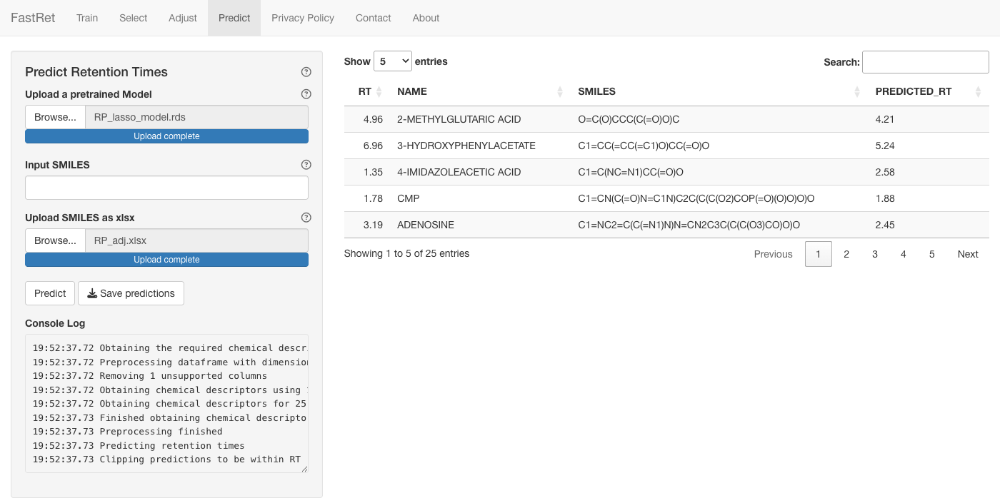
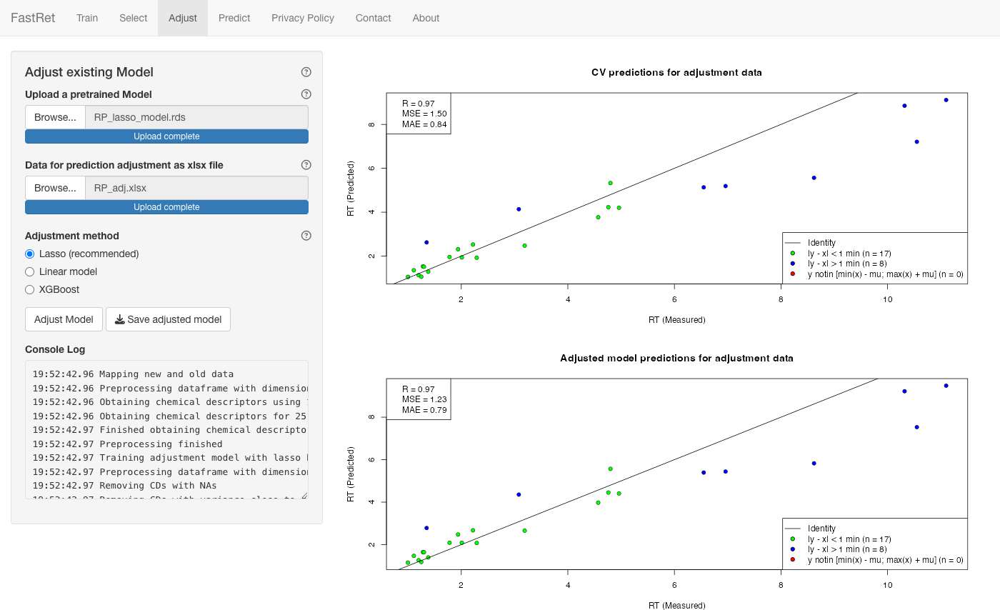
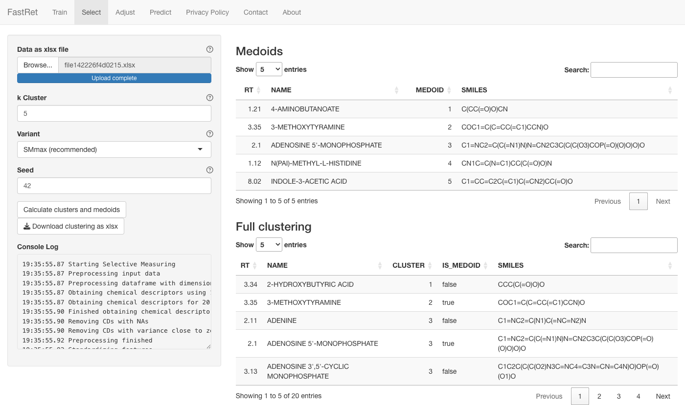

```{r, include = FALSE}
knitr::opts_chunk$set(collapse = TRUE, comment = "#>")
```

This tutorial shows how to start the FastRet GUI and use its four modes.

# Starting the GUI

Install the package and run this in an interactive R session:

```{r gui, eval = FALSE}
FastRet::start_gui()
```

The console prints:

```
Listening on http://localhost:8080
```

Open <http://localhost:8080> in your browser to use the GUI.

The GUI has four modes, shown as tabs at the top: **Train**, **Select**,
**Adjust** and **Predict**. Hover over a tab to see its full name. Click the
question-mark icon next to any input for a short help text.

If `start_gui()` reports a CDK version error, FastRet needs CDK 2.9 or newer and
a working Java installation. See the
[Installation](https://spang-lab.github.io/FastRet/articles/Installation.html)
article for how to set up Java and `rcdk`.

# Train new Model

Use the **Train** tab to build a model from your own measurements: an Excel file
with the names, SMILES and retention times of metabolites measured on your
column. FastRet ships an example file with 442 metabolites measured on a
reverse-phase column (35 °C, 0.3 ml/min). To see its path and contents:

```{r example-file, eval = TRUE}
path <- system.file("extdata", "RP.xlsx", package = "FastRet")
cat(path, "\n", sep = "")
df <- openxlsx::read.xlsx(path, 1)
head(df)
```

Set the controls, then click **Train Model**:

1.  **Data as xlsx file** --- your Excel file (columns `RT`, `NAME`, `SMILES`).
2.  **Method** --- *XGBoost (recommended)* or *Lasso*.
3.  **Seed** --- random seed. Keep the default (`42`) for reproducible results.

The **Console Log** shows progress. When training finishes, the main panel shows
the cross-validation and training plots and a table of predictions. For the
details, see
[Model-Training](https://spang-lab.github.io/FastRet/articles/Package-Internals.html#model-training)
in the
[Package-Internals](https://spang-lab.github.io/FastRet/articles/Package-Internals.html)
article.

<a href="GUI-Usage/train.png"></a>

Two buttons then appear: **Save Model** (an `.rds` file) and **Save Predictor
Set** (the training data with descriptors). To predict with your model, save it,
switch to the **Predict** tab, upload it there, enter your SMILES and click
*Predict* (see [Predict Retention Times](#predict-retention-times)).

# Predict Retention Times

Use a saved model to predict retention times for new molecules:

1.  Upload the model under *Upload a pretrained Model*.
2.  Enter a SMILES in *Input SMILES*, or upload an Excel file (columns `NAME`,
    `SMILES`) under *Upload SMILES as xlsx*.
3.  Click *Predict*.

The predictions appear as a table in the main panel. Click *Save predictions* to
download them as an Excel file.

<a href="GUI-Usage/predict.png"></a>

# Adjusting existing model

If you re-measured some metabolites on a new column that were also measured on
the original one, use the **Adjust** tab to adapt an existing model to the new
column:

1.  Upload the model under *Upload a pretrained Model*.
2.  Upload the re-measured metabolites (columns `RT`, `NAME`, `SMILES`) under
    *Data for prediction adjustment as xlsx file*.
3.  Choose the **Adjustment method**: *Lasso (recommended)*, *Linear model* or
    *XGBoost*. Lasso and XGBoost use the base retention time and the molecular
    descriptors, so they can capture compound-specific shifts; the linear model
    fits a straight-line correction from the base retention time alone.
4.  Click *Adjust Model*.

The main panel shows the performance of the adjusted model. Click *Save adjusted
model* to download it. Use it like any other model on the **Predict** tab.

<a href="GUI-Usage/adjust.png"></a>

# Selective Measuring

Adjusting a model to a new column needs a few metabolites measured on that
column. The **Select** tab picks the `k` most representative molecules to
measure, so you cover the diversity of your dataset with as little lab work as
possible. It uses Ridge Regression and PAM (k-medoids) clustering.

1.  Upload an Excel file (columns `NAME`, `SMILES`, `RT`).
2.  **k Cluster** --- how many molecules to select.
3.  **Variant** --- how strongly the retention time guides the selection:
    *SMmax* (default, weighted like the most important descriptor), *SM1*
    (unscaled), *SM0* (excluded) or *SMinf* (retention time only). The info
    button explains each.
4.  **Seed** --- random seed. Keep the default (`42`) for a reproducible
    selection.
5.  Click *Calculate clusters and medoids*.
6.  Click *Download clustering as xlsx* to save the selected molecules and their
    clusters.

The main panel lists the selected molecules and the full clustering. Measure the
selected molecules on the new column, then use them to
[adjust your model](#adjusting-existing-model).

<a href="GUI-Usage/select.png"></a>
