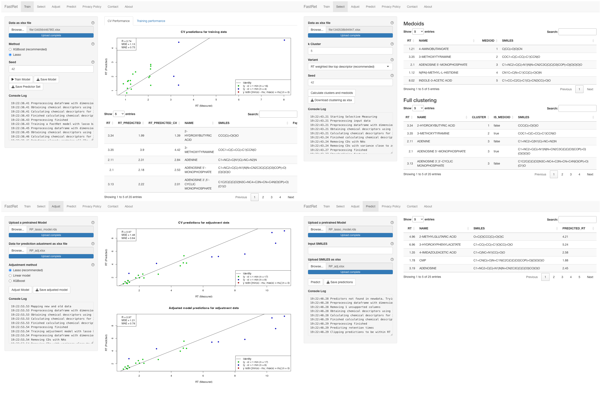

```{r, include = FALSE}
knitr::opts_chunk$set(collapse = TRUE, comment = "#>")
```

This tutorial will show how you can start the FastRet GUI and explain the
features it provides.

# Starting the GUI

To start the GUI, [install the package](#installation) and then run the
following command in an interactive R terminal:

```{r gui, eval = FALSE}
FastRet::start_gui()
```

After running the above code, you should see an output like

```
Listening on http://localhost:8080
```

in your R console. This means that the GUI is now running and you can access it
via the URL <http://localhost:8080> in your browser. If your terminal supports
it, you can also click on the displayed link.

The GUI is organized into four modes, available as tabs in the navigation bar at
the top of the page: **Train**, **Select**, **Adjust** and **Predict** (followed
by the *Privacy Policy*, *Contact* and *About* pages). The tabs use short labels;
hovering over a tab shows its full name (*Train new Model*, *Selective Measuring*,
*Adjust existing Model* and *Predict Retention Times*). By default the GUI opens
on the **Train** tab. Every input has a small question-mark icon next to it that
shows a short help text when clicked.

<a href="GUI-Usage/gui-overview-2x2.png">

</a>

If `start_gui()` stops with an error about the CDK version (FastRet requires CDK
2.9 or greater, which in turn requires a working Java installation), see the
[Installation](https://spang-lab.github.io/FastRet/articles/Installation.html)
article for how to set up Java and `rcdk`.

# Train new Model

In mode *Train new Model* you can upload Excel files containing the names,
SMILES and retention times of metabolites measured on your specific
chromatography column and use this data to train a predictive model. FastRet
includes an example Excel file with retention times for 442 metabolites
measured on a reverse phase liquid chromatography column at a temperature of 35
degree celsius and a flowrate of 0.3ml/min. To print the file path of this excel
file and a preview of its contents, enter the following lines an interactive R
session:

```{r example-file, eval = TRUE}
path <- system.file("extdata", "RP.xlsx", package = "FastRet")
cat(path, "\n", sep = "")
df <- openxlsx::read.xlsx(path, 1)
head(df)
```

The **Train** tab keeps the controls to a minimum:

1.  **Data as xlsx file** --- upload your Excel file (columns `RT`, `NAME` and
    `SMILES`).
2.  **Method** --- choose between *XGBoost (recommended)* and *Lasso*.
3.  **Seed** --- the seed of the random number generator. It defaults to a fixed
    value (`42`) so that training the same data twice yields identical models;
    change it only if you want to assess the variability across random seeds.

Click **Train Model** to start training. Training may take some time, depending
on the size of the training set and the chosen method; the **Console Log** at the
bottom of the sidebar (always visible) shows the progress. Upon completion, the
main panel shows the cross-validation and training performance plots together
with a table of the training dataset and its predictions. For further details
about the training process and the performance measures, see section
[Model-Training](https://spang-lab.github.io/FastRet/articles/Package-Internals.html#model-training)
of article
[Package-Internals](https://spang-lab.github.io/FastRet/articles/Package-Internals.html).

<a href="GUI-Usage/train.png"></a>

Once a model has been trained, two download buttons appear in the sidebar:
**Save Model** (the model as an `.rds` file) and **Save Predictor Set** (the
training data together with the computed descriptors). To use the trained model
to predict retention times for new molecules, you have to:

1. Save the model by clicking the *Save Model* button
2. Switch to the *[Predict](#predict-retention-times)* tab
3. Upload the model again while on the *Predict* tab
4. Enter the SMILES of the molecules you want to predict retention times for
5. Click *Predict*

A more detailed guide on using the FastRet GUI for prediction is given in the
next section [Predict Retention Times](#predict-retention-times).

# Predict Retention Times

In this mode, previously saved models can be used to make predictions for new
data. To do so:

1.  Click the *Browse* button in section *Upload a pretrained Model* and select
    the model you saved before
2.  Either enter the SMILES of your molecule of interest in the *Input SMILES*
    text field, or
3.  Click the *Browse* button in section *Upload SMILES as xlsx* and select an
    Excel file containing columns `NAME` and `SMILES`
4.  Click the *Predict* button

The predicted retention times are shown as a table in the main panel and the
**Console Log** reports the progress. Click *Save predictions* to download the
results as an Excel file.

<a href="GUI-Usage/predict.png"></a>

# Adjusting existing model

If you have measured some metabolites on your new experimental setup that were
also measured on the original setup, you can use this mode to adjust an existing
model to the new column. To do so, switch to the **Adjust** tab and:

1.  Upload the model you want to adjust via *Upload a pretrained Model*
2.  Upload an Excel file with the metabolites re-measured on the new column
    (columns `RT`, `NAME` and `SMILES`) via *Data for prediction adjustment as
    xlsx file*
3.  Choose the **Adjustment method**: *Lasso (recommended)*, *Linear model* or
    *XGBoost*. Lasso and XGBoost adjust using the base retention time together
    with the molecular descriptors and can therefore capture compound-specific
    shifts, whereas the linear model fits a simple straight-line correction from
    the base retention time only.
4.  Click *Adjust Model*

The main panel then shows the cross-validation and training performance of the
adjusted model, and *Save adjusted model* lets you download it. The adjusted
model can be used like any other model on the *Predict* tab.

<a href="GUI-Usage/adjust.png"></a>

# Selective Measuring

This mode calculates, for a given data set, the best `k` molecules to be measured
on a new experiment setup. It combines Ridge Regression with PAM (Partitioning
Around Medoids, also known as k-medoids) clustering to determine the most
representative molecules of your dataset. These representatives, together with
their corresponding clusters, can then be downloaded as an Excel file.

Use this mode when you already have a predictive model and/or data set and want
to adapt it to a new column with different chromatographic properties (gradient,
temperature, etc.): measuring only the selected representatives on the new column
keeps the experimental effort low while still capturing the diversity of your
dataset, so the resulting measurements can be used to [adjust your
model](#adjusting-existing-model).

To use this mode, switch to the **Select** tab and:

1.  Upload an Excel file containing columns `NAME`, `SMILES` and `RT` via the
    *Browse* button
2.  Set the number of molecules to select in the *k Cluster* field
3.  Click the *Calculate clusters and medoids* button
4.  Click *Download clustering as xlsx* to save the selected representatives and
    their clusters

The main panel lists the selected medoids and the full clustering, and the
**Console Log** reports the progress of the calculation.

<a href="GUI-Usage/select.png"></a>
