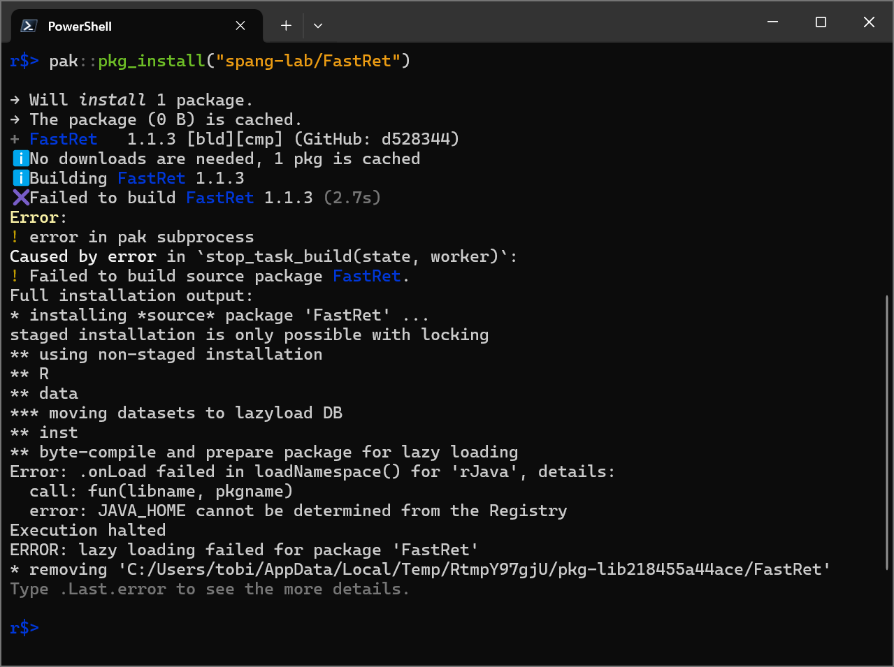

Installation of FastRet consist of the following three steps, which are explained in detail in the following sections.

1. Install Java Development Kit (JDK) version 11 or higher
2. Use `install.packages("pak")` to install the R package manager `pak` from CRAN
3. Use `pak::pkg_install("FastRet")` to install `FastRet` from the GitHub repository

# Install Java Development Kit (JDK)

FastRet uses the `rJava` package, which itself requires the Java Development Kit (JDK) version 11 or higher. You can test whether you java a sufficiently high version of JDK already installed on your system by entering the following command in your terminal.

```bash
java -version
```

If you do not have a suitable JDK installed, you can download and install it from various vendors such as the [Adoptium Working Group] or [Azul]. For a list of vendors providing JDKs, see [whichjdk.com].

When installing a JDK, there a few things to look out for, e.g.:

1. Windows users should activate the update of "JavaSoft registry keys" during the installation process. This is necessary for the `rJava` package to find the SDK installation. Depending on the SDK vendor you choose, the option might be named differently.
2. macOS users must use at least R-4.1.2.
3. Linux users should run `R CMD javareconf` after installing the JDK to make sure that R can find the JDK.

[Adoptium Working Group]: https://adoptium.net/de/temurin/releases
[Azul]: https://www.azul.com/downloads/?package=jdk#download-openjdk
[whichjdk.com]: https://whichjdk.com/

# Install the R package manager `pak`

This can be done by entering the following command in an R session:

```r
install.packages("pak")
```

# Install FastRet

To install FastRet from the GitHub repository, enter the following command in an R session:

```r
pak::pkg_install("FastRet")
```

# Troubleshooting

## JAVA_HOME cannot be determined from the Registry

The error message `JAVA_HOME cannot be determined from the Registry` indicates that the `rJava` package cannot find the JDK installation.
This can cause further errors such as `ERROR: lazy loading failed for package 'FastRet'` when trying to load FastRet.
See [rJava installation fails](#rjava-installation-fails) for possible solutions.

<a href="Installation/error_JAVA_HOME_not_found.png"></a>

## rJava installation fails

If the installation of the `rJava` package fails:

1. Make sure you have a suitable JDK installed on your system, as described in [Install Java Development Kit (JDK)](#install-java-development-kit-jdk).
2. Reinstall the `rJava` package by entering the following command in an R session: `install.packages("rJava")`.
3. Run `library("rJava")` to ensure that the package can be loaded.

If this doesn't solve your problem, have a look the [Troubleshooting Guide of the rJava package](https://github.com/s-u/rJava?tab=readme-ov-file#troubleshooting).
